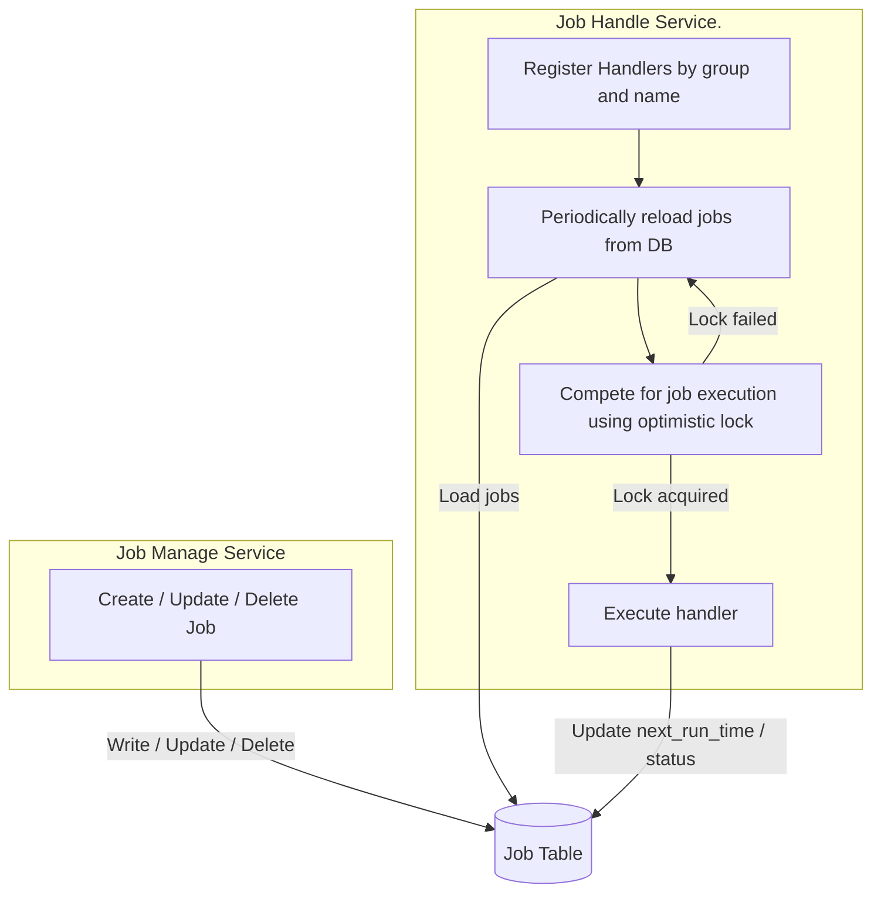
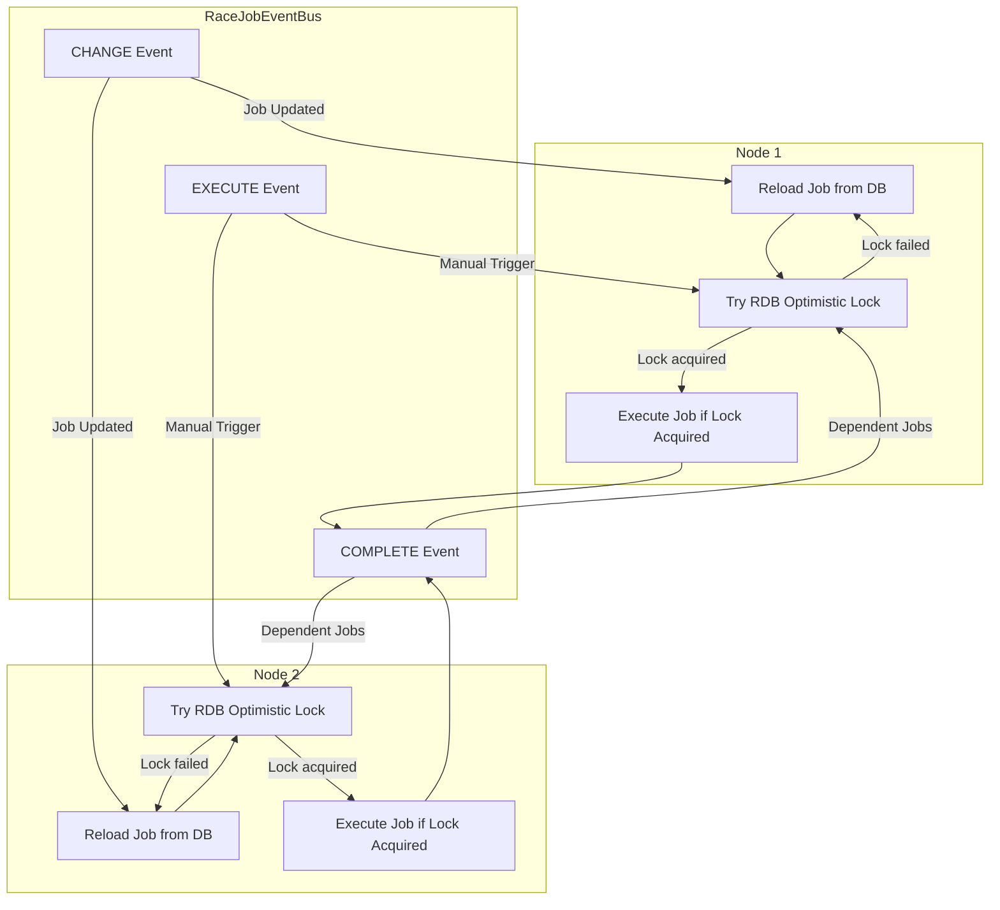

# Race Job

A lightweight and extensible Java scheduling library designed for distributed environments.  
By separating **job definition**, **job management**, and **job execution**, *race-job* ensures that in a multi-instance cluster **each job runs exactly once** using **RDB optimistic locking**.

If you implement `RaceJobEventBus`, the system automatically synchronizes job changes across nodes, enabling a fully **distributed scheduler**.

---

## 📌 Features

- **Cluster-safe job execution** — only one instance runs each job using RDB optimistic locking.
- **Clear separation of job management and execution**.
- **Extendable Event Service** for distributed message sync.
- **Cron scheduling, dependent jobs, dynamic job updates**.
- **No Quartz required** — simpler, safer, and easier to maintain.

---

## 📘 Architecture Overview



## 🧩 Requirements

* Spring Boot 2+
* Java 11+

## 🚀 Quick Start
1. Add Dependency

    ```xml
    
    <dependency>
        <groupId>io.github.babyblue94520</groupId>
        <artifactId>race-job</artifactId>
        <version>1.0.0-RELEASE</version>
    </dependency>
    ```

2. Configuration (application.yml)

    ```yaml
    race-job:
      instance: raceJobScheduler
      reload-interval: 60000
      thread-count: 20 # default processors * 2
      check-wait-time: 1000 # Wait time to check if a job is being processed
      update-active-interval: 60000 # The running job periodically updates its last active timestamp
      abort-on-error: true # If true, aborts the task on exception
    ```

3. Enable Race Job

    ```java
    
    @EnableRaceJob
    public class RaceJobConfig {
    
    }
    ```

### 🛠 Create or Update a Job

```java
@EnableRaceJob
public class RaceJobConfig {

    @Autowired
    private RaceJobScheduler scheduler;

    @Override
    public void afterPropertiesSet() throws Exception {
        scheduler.add(RaceJob.builder()
                .group("group")
                .name("name")
                .cron("* * * * * ?")
                .timezone("+00:00")
                .build());
    }
}
```

🏃 Register Job Handler

```java
@Component
public class RaceJobHandlerRegister implements InitializingBean {

  @Autowired
  private RaceJobScheduler scheduler;
  
  @Override
  public void afterPropertiesSet() throws Exception {
      String group = "group";
      String name = "name";
      scheduler.registerHandler(new RaceJobKey(group, name), (job) -> {
          // Do something
      });
  }
}
```
### 🔗 Creating Dependent Jobs

Jobs can be triggered after another job finishes.

```java
@EnableRaceJob
public class RaceJobConfig {

    @Autowired
    private RaceJobScheduler scheduler;

    @Override
    public void afterPropertiesSet() throws Exception {
        scheduler.add(RaceJob.builder()
                .group("after-group")
                .name("after-name")
                .afterGroup("group")
                .afterName("name")
                .build());
    }
}
```

### 🌐 Enable Distributed Mode with Event Service

Implementing `RaceJobEventBus` allows job changes to be broadcast across all nodes, enabling full distributed synchronization.

### Event Type

* CHANGE 

    When a job is updated, notify other nodes to reload immediately

* COMPLETE

    When a job completes, notify other nodes to execute dependent jobs

* EXECUTE

    When manually executing a job, notify other nodes to execute the job

Example Implementation

**Example**

```java
import java.util.concurrent.CopyOnWriteArrayList;

@Log4j2
@Service
public class RaceJobEventBusImpl implements RaceJobEventBus {

    private static final List<Consumer<String>> listeners = new CopyOnWriteArrayList<>();
    private static final ExecutorService executor = Executors.newFixedThreadPool(1);

    @Override
    public void send(String body) {
        executor.submit(() -> {
            listeners.forEach(consumer -> consumer.accept(body));
        });
    }

    @Override
    public void listen(Consumer<String> listener) {
        listeners.add(listener);
    }
}
```



## 💾 Database Schema

### MySQL

```sql
CREATE TABLE IF NOT EXISTS `race_job`
(
    `instance`              varchar(100)    NOT NULL DEFAULT '',
    `group`                 varchar(100)    NOT NULL DEFAULT '',
    `name`                  varchar(100)    NOT NULL DEFAULT '',
    `timezone`              varchar(10)     NOT NULL DEFAULT '',
    `description`           varchar(200)    NOT NULL DEFAULT '',
    `cron`                  varchar(200)    NOT NULL DEFAULT '',
    `after_group`           varchar(100)    NOT NULL DEFAULT '',
    `after_name`            varchar(100)    NOT NULL DEFAULT '',
    `prev_time`             bigint(13)      NOT NULL DEFAULT 0,
    `next_time`             bigint(13)      NOT NULL DEFAULT 0,
    `enabled`               tinyint(1)      NOT NULL DEFAULT 1,
    `state`                 int(1)          NOT NULL DEFAULT 0,
    `start_time`            bigint(13)      NOT NULL DEFAULT 0,
    `end_time`              bigint(13)      NOT NULL DEFAULT 0,
    `last_active_time`      bigint(13)      NOT NULL DEFAULT 0,
    `data`                  text            NULL,
    PRIMARY KEY (`instance`, `group`, `name`) USING BTREE
) ENGINE = InnoDB
CHARACTER SET = utf8mb4
COLLATE = utf8mb4_unicode_ci
ROW_FORMAT = Dynamic;

```
