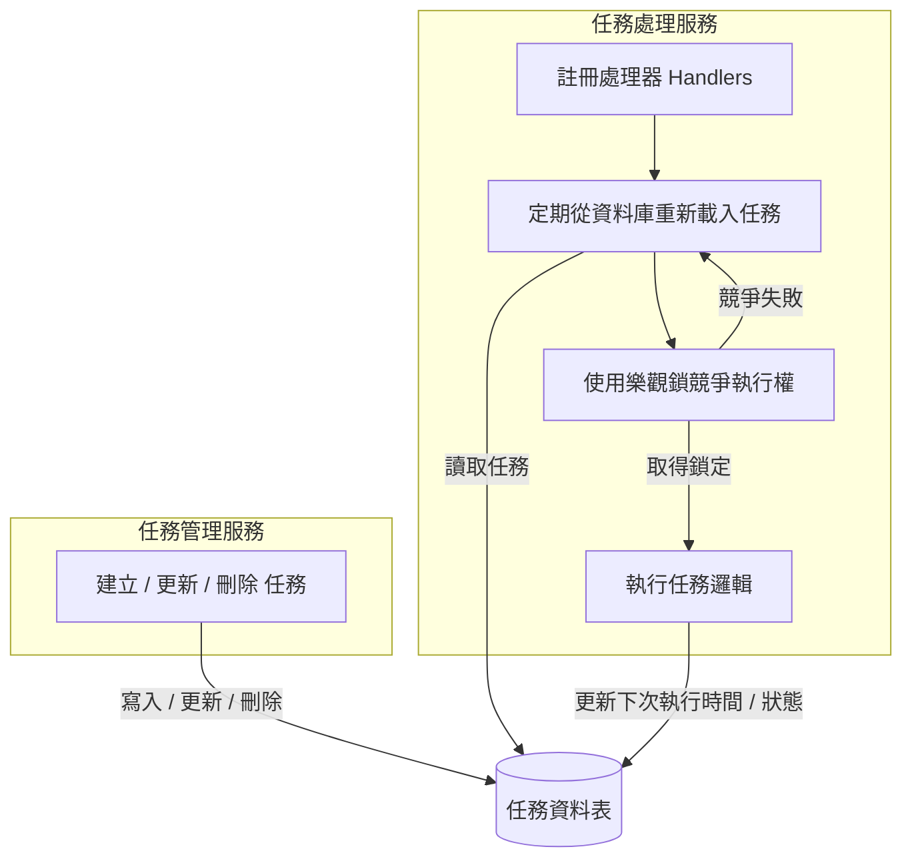

# Race Job (輕量級分散式任務調度框架)

Race Job 是一個專為分散式環境設計的輕量級且可擴展的 Java 任務調度庫。  
透過將 **任務定義 (Job Definition)**、**任務管理 (Job Management)** 與 **任務執行 (Job Execution)** 分離，*race-job* 利用 **關聯式資料庫 (RDB) 的樂觀鎖 (Optimistic Locking)** 確保在多實例集群環境中，**每個任務只會被執行一次**。

如果您實作了 `RaceJobEventBus`，系統會自動在節點間同步任務變更，實現完整的 **全分散式調度器**。

---

## 📌 核心功能

-   **集群安全執行**：利用 RDB 樂觀鎖機制，確保每項任務在集群中僅由一個實例執行。
-   **管理與執行分離**：清晰的職責劃分，易於維護與擴展。
-   **可擴展的時間軸服務**：支援分散式訊息同步 (Event Bus)。
-   **功能豐富**：支援 Cron 表達式、任務依賴鏈 (DependsKey)、動態任務更新。
-   **無須 Quartz**：比 Quartz 更輕量、更安全、更易於維護。

---

## 📘 架構概覽



---

## 🧩 系統需求

-   Spring Boot 2+
-   Java 11+

## 🚀 快速上手

### 1. 添加依賴

```xml
<dependency>
    <groupId>io.github.babyblue94520</groupId>
    <artifactId>race-job</artifactId>
    <version>1.0.0-RELEASE</version>
</dependency>
```

### 2. 環境配置 (application.yml)

```yaml
race-job:
  instance: raceJobScheduler     # 實例名稱
  reload-interval: 60000         # 資料庫同步週期
  thread-count: 20               # 任務執行緒池大小
  check-wait-time: 1000          # 任務搶佔後的等待確認時間
  update-active-interval: 60000  # 執行中任務的活性檢索頻率
  execution-enabled: true        # 是否開啟任務執行引擎 (全域開關)
  abort-on-error: true           # 發生異常時是否自動移除 Handler
```

### 3. 啟用 Race Job

```java
@EnableRaceJob
@Configuration
public class RaceJobConfig {
}
```

---

## 🛠 任務管理

### 建立與更新任務

*   **建立 (Create)**：若任務不存在則建立；若已存在且版本號相同，則不執行任何動作。
*   **更新 (Update)**：必須增加 `version` (版本號) 才會觸發資料庫更新。
*   **注意**：`enabled` 狀態無法透過 `add()` 方法修改，請使用 `enable()` / `disable()` 方法。

```java
@Autowired
private RaceJobScheduler scheduler;

// 建立任務
scheduler.add(RaceJob.builder()
        .group("group1").name("job1").key("job-key-1")
        .cron("0/5 * * * * ?")
        .version(1)
        .build());

// 更新任務 (需增加 version)
scheduler.add(RaceJob.builder()
        .group("group1").name("job1").key("job-key-1")
        .version(2)
        .cron("0/10 * * * * ?")
        .build());

// 控制開關
scheduler.enable(new RaceJobKey("group1", "job1"));
scheduler.disable(new RaceJobKey("group1", "job1"));
```

### 註冊處理器 (Handler)

```java
scheduler.registerHandler("job-key-1", (job) -> {
    System.out.println("正在執行任務: " + job.getName());
});
```

### 任務依賴 (Workflow)

任務可以在另一個任務完成後被觸發：

```java
scheduler.add(RaceJob.builder()
        .group("group1")
        .name("dependent-job")
        .dependsKey("job-key-1") // 當 job-key-1 完成後觸發
        .build());
```

---

## 🌐 分散式模式 (Event Service)

實作 `RaceJobEventBus` 可以讓任務變更即時廣播到所有節點。

### 事件類型：
*   **CHANGE**：任務更新時，通知其他節點立即 reload。
*   **COMPLETE**：任務完成時，通知其他節點觸發依賴任務。
*   **EXECUTE**：手動執行任務時，通知集群進行競爭執行。

---

## 💾 資料庫結構 (MySQL)

```sql
CREATE TABLE IF NOT EXISTS `race_job`
(
    `instance`              varchar(100)    NOT NULL DEFAULT '',
    `group`                 varchar(100)    NOT NULL DEFAULT '',
    `name`                  varchar(100)    NOT NULL DEFAULT '',
    `key`                   varchar(100)    NOT NULL DEFAULT '',
    `version`               int             NOT NULL DEFAULT 1,
    `timezone`              varchar(10)     NOT NULL DEFAULT '',
    `description`           varchar(200)    NOT NULL DEFAULT '',
    `cron`                  varchar(200)    NOT NULL DEFAULT '',
    `depends_key`           varchar(100)    NOT NULL DEFAULT '',
    `prev_time`             bigint(13)      NOT NULL DEFAULT 0,
    `next_time`             bigint(13)      NOT NULL DEFAULT 0,
    `enabled`               tinyint(1)      NOT NULL DEFAULT 1,
    `state`                 int(1)          NOT NULL DEFAULT 0,
    `start_time`            bigint(13)      NOT NULL DEFAULT 0,
    `end_time`              bigint(13)      NOT NULL DEFAULT 0,
    `last_active_time`      bigint(13)      NOT NULL DEFAULT 0,
    `data`                  text            NULL,
    PRIMARY KEY (`instance`, `group`, `name`) USING BTREE
) ENGINE = InnoDB ROW_FORMAT = Dynamic;
```
